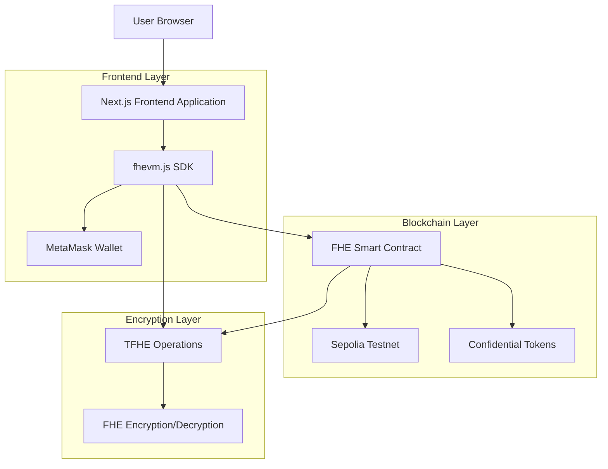
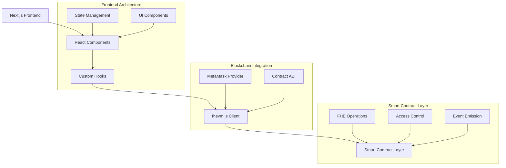
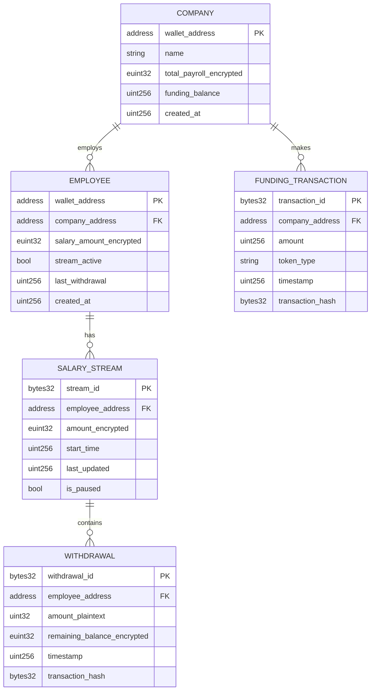

# FHE-Pay Technical Architecture Document

## 1. Architecture Design



## 2. Technology Description

* Frontend: Next.js\@14 + React\@18 + TailwindCSS\@3 + TypeScript + fhevm.js

* Smart Contract: Solidity + fhevm-solidity + TFHE.sol

* Wallet Integration: MetaMask + RainbowKit

* Blockchain: Sepolia Testnet (Ethereum)

* Confidential Tokens: cUSDT, cETH (Zama provided)

* Encryption: Fully Homomorphic Encryption via TFHE

## 3. Route Definitions

| Route      | Purpose                                                  |
| ---------- | -------------------------------------------------------- |
| /          | Landing page with product overview and wallet connection |
| /dashboard | Company admin dashboard with payroll overview            |
| /employees | Employee management interface for admins                 |
| /funding   | Payroll wallet funding and balance management            |
| /portal    | Employee personal portal for salary and withdrawals      |
| /reports   | Encrypted analytics and compliance reports               |
| /auth      | Authentication and role verification page                |

## 4. API Definitions

### 4.1 Core Smart Contract Functions

**Create Confidential Stream**

```solidity
function createConfidentialStream(address employee, euint32 encryptedAmount) external onlyAdmin
```

Parameters:

| Param Name      | Param Type | isRequired | Description                 |
| --------------- | ---------- | ---------- | --------------------------- |
| employee        | address    | true       | Employee wallet address     |
| encryptedAmount | euint32    | true       | FHE encrypted salary amount |

Events Emitted:

```solidity
event StreamCreated(address indexed employee, bytes32 streamId);
```

**Get Encrypted Balance**

```solidity
function getEncryptedBalance(address employee) external view returns (euint32)
```

Parameters:

| Param Name | Param Type | isRequired | Description             |
| ---------- | ---------- | ---------- | ----------------------- |
| employee   | address    | true       | Employee wallet address |

Returns:

| Param Name | Param Type | Description                 |
| ---------- | ---------- | --------------------------- |
| balance    | euint32    | Encrypted available balance |

**Secure Withdrawal**

```solidity
function withdraw(uint32 amount) external
```

Parameters:

| Param Name | Param Type | isRequired | Description                    |
| ---------- | ---------- | ---------- | ------------------------------ |
| amount     | uint32     | true       | Withdrawal amount in plaintext |

Validation:

* Uses TFHE.le(encryptedAmount, encryptedBalance) for secure comparison

* Emits WithdrawalProcessed event on success

**Update Stream**

```solidity
function updateStream(address employee, euint32 newAmount) external onlyAdmin
```

Parameters:

| Param Name | Param Type | isRequired | Description                 |
| ---------- | ---------- | ---------- | --------------------------- |
| employee   | address    | true       | Employee wallet address     |
| newAmount  | euint32    | true       | New encrypted salary amount |

### 4.2 Frontend API Integration

**FHE Encryption Service**

```typescript
interface FHEService {
  encryptAmount(amount: number): Promise<euint32>;
  decryptAmount(encryptedAmount: euint32): Promise<number>;
  createInstance(): Promise<FhevmInstance>;
}
```

**Wallet Connection Service**

```typescript
interface WalletService {
  connect(): Promise<string>;
  getBalance(tokenAddress: string): Promise<bigint>;
  signTransaction(tx: TransactionRequest): Promise<string>;
}
```

## 5. Server Architecture Diagram



## 6. Data Model

### 6.1 Data Model Definition



### 6.2 Data Definition Language

**Smart Contract Storage Structure**

```solidity
// Company management
struct Company {
    address admin;
    euint32 totalPayrollEncrypted;
    uint256 fundingBalance;
    bool isActive;
}

// Employee salary stream
struct SalaryStream {
    address employee;
    euint32 salaryAmountEncrypted;
    uint256 startTime;
    uint256 lastWithdrawal;
    bool isActive;
    bool isPaused;
}

// Withdrawal record
struct WithdrawalRecord {
    address employee;
    uint32 amount;
    uint256 timestamp;
    bytes32 transactionHash;
}

// Storage mappings
mapping(address => Company) public companies;
mapping(address => SalaryStream) public salaryStreams;
mapping(address => WithdrawalRecord[]) public withdrawalHistory;
mapping(address => euint32) public encryptedBalances;

// Access control
mapping(address => bool) public authorizedAdmins;
mapping(address => address) public employeeToCompany;

// Events for transparency
event StreamCreated(address indexed employee, address indexed company, bytes32 streamId);
event WithdrawalProcessed(address indexed employee, uint32 amount, uint256 timestamp);
event StreamUpdated(address indexed employee, uint256 timestamp);
event StreamPaused(address indexed employee, bool isPaused);
event FundingReceived(address indexed company, uint256 amount, string tokenType);
```

**Initialization Data**

```solidity
// Contract deployment initialization
constructor() {
    // Initialize TFHE library
    TFHE.setFHEVM(FhevmAddress(0x000000000000000000000000000000000000005d));
    
    // Set contract owner
    owner = msg.sender;
    
    // Initialize supported confidential tokens
    supportedTokens["cUSDT"] = true;
    supportedTokens["cETH"] = true;
}

// Access control setup
modifier onlyAdmin() {
    require(authorizedAdmins[msg.sender] || companies[msg.sender].admin == msg.sender, "Unauthorized");
    _;
}

modifier onlyEmployee() {
    require(salaryStreams[msg.sender].employee == msg.sender, "Not an employee");
    _;
}

// FHE permission setup for encrypted data access
function setupFHEPermissions(address user) internal {
    // Grant permission to decrypt own salary data
    TFHE.allow(encryptedBalances[user], user);
    
    // Grant permission to company admin for management
    address companyAdmin = employeeToCompany[user];
    if (companyAdmin != address(0)) {
        TFHE.allow(encryptedBalances[user], companyAdmin);
    }
}
```

